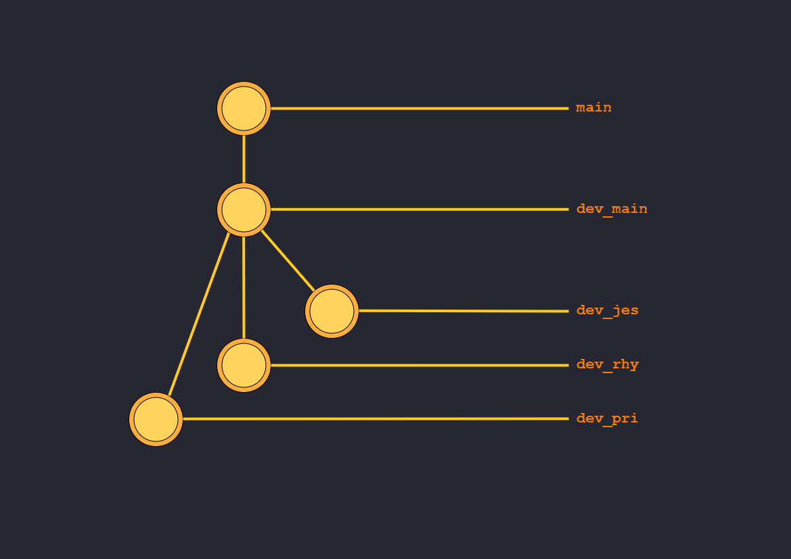

# CF-Site

### workflow

1. fork the repository to your account
2. do all the required changes in your fork
3. once you are done with your changes, pull the latest changes from our repository  
   (this is to fetch any parallel changes made after you forked the repo)
4. check your changes to ensure they do not break the current code
5. create a pull request (pr) to `dev_main`
6. make sure to provide a clear and proper description in your pr
7. if we receive more than one pr at the same time, after merging one pr, the next contributor may be asked to pull the latest changes again and re-check their pr for conflicts

### Branch Architecture

